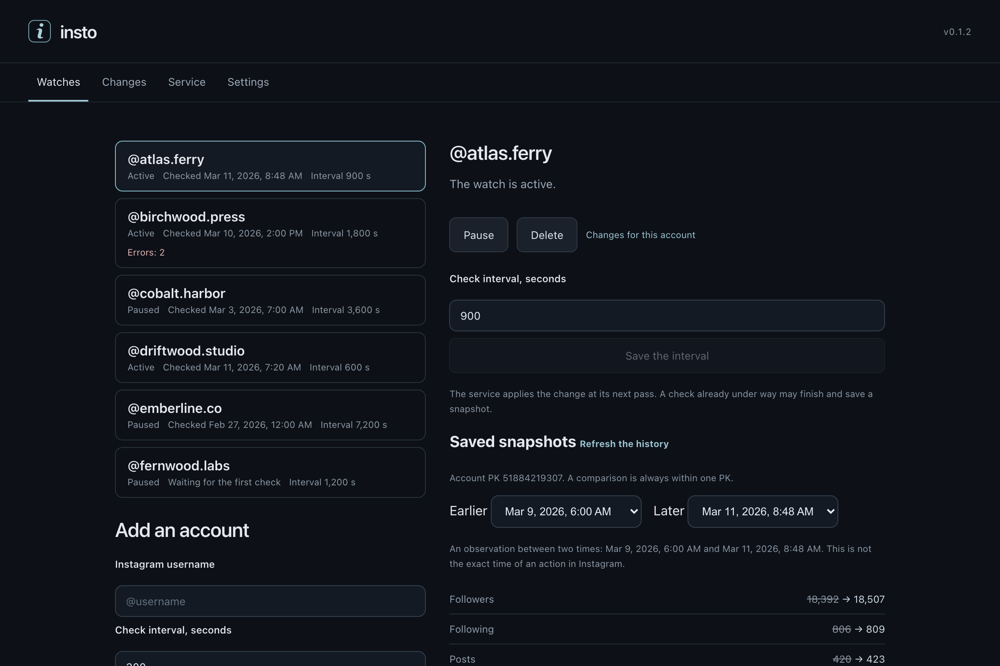

<div align="center">

# insto-gui

A self-contained macOS app that watches Instagram accounts in the background and tells you what changed — **no Instagram login required**.

Powered by [HikerAPI](https://hikerapi.com/p/uk064a1b) · built with [Tauri 2](https://tauri.app) + Vue 3

</div>

---

Paste your HikerAPI token once, add a few accounts, and a background service keeps checking them on the interval you choose — it goes on running after you close the window. The app saves a snapshot of every check and shows you the difference between any two of them: followers gained and lost, a rewritten bio, a new avatar, a profile that turned private. Because the checks go through the HikerAPI cloud instead of a logged-in session, **your Instagram account never touches the flow**.



> The interface is in English; Russian can be chosen in **Settings**.

## Features

- **Watched accounts** — add by username, give each one its own check interval (300 s and up), pause, resume or remove it; up to three watches run at a time
- **Status you can trust** — each row shows the last *successful* check, not the fact that a process is alive, plus the interval and any run of consecutive errors
- **Snapshot history** — every successful check is stored; pick any two saved snapshots of one account and compare exactly those two
- **Change feed** — all accounts, newest first, filterable down to one; a first snapshot is labelled a baseline rather than dressed up as a change, and a comparison whose older snapshot lacked a field is labelled incomplete rather than guessed at
- **Tracked fields** — username, full name, biography, profile link, verified / business / private flags, follower, following and media counts, and avatar and banner hashes
- **Background service** — a macOS LaunchAgent that keeps checking with the app closed; start, stop and repair it from the app, and disable it from **Settings** before you move the app to the Trash
- **Bundled core** — a compatible Python insto core ships inside the app; no Python, uv or CLI install, and no downloads on first run
- **Adopts an existing `~/.insto`** — inspect the folder first, connect it only after an explicit confirmation, and go back to the app's own profile later without the folder's files being touched
- **Takes over a CLI service** — a service registered by the insto CLI can be moved onto the runtime this app ships, automatically for the app's own profile and only on your command for an adopted one
- **Reads nothing behind your back** — the window itself makes no HikerAPI requests; it reads local state, and the remaining HikerAPI balance is shown with the time it was last checked
- **Says when it does not know** — an operation whose outcome cannot be confirmed is reported as unknown and the state is re-read, never silently repeated

## Download

Requires **macOS 14 (Sonoma) or newer**.

Take the file for your Mac from [GitHub Releases](https://github.com/subzeroid/insto-gui/releases) and drag `insto.app` to `/Applications`. Apple menu → *About This Mac* shows which chip you have.

| Mac | File |
|---|---|
| Apple Silicon (M1 and later) | `insto_x.y.z_aarch64.dmg` |
| Intel | `insto_x.y.z_x64.dmg` |

Or install the cask:

```sh
brew install --cask subzeroid/tap/insto
```

The cask is published shortly after each release; if `brew` cannot find it yet, use the download. Either way, follow *First launch* below once. (Homebrew no longer has `--no-quarantine`. To skip the prompt from a terminal instead, run `xattr -dr com.apple.quarantine /Applications/insto.app`; do it only if you have checked the DMG hash against `SHA256SUMS` on the release page.)

## First launch

The app is ad-hoc signed and not notarized, so macOS refuses it once:

1. Open `insto.app`. macOS says it cannot verify the app. Close the dialog.
2. Open System Settings → Privacy & Security, scroll to the message about insto and choose *Open Anyway*. On macOS 14, Control-click → *Open* also works.
3. Open the app again. This happens only once per download.

## Getting a token

1. Sign up at [hikerapi.com](https://hikerapi.com/p/uk064a1b) — **the first 100 requests are free**, no card needed.
2. Copy the token from your [HikerAPI dashboard](https://hikerapi.com/p/uk064a1b).
3. Paste it into the app on first launch.

Every check of a watched account spends HikerAPI requests, so the check interval — not the number of times you open the window — decides how fast the balance goes down. The remaining balance is shown in the **Service** section together with the moment it was last read; it is a reading, not a live counter. You can replace the token later in **Settings** without losing history.

## How monitoring works

The app bundles its own Python insto core, so nothing is installed alongside it. When you connect a token, it registers a macOS LaunchAgent that performs the checks; that agent keeps running after the window is closed, and moving the app to the Trash does not remove it — disable it from **Settings** first, which leaves the settings, the snapshot history and the token in place.

If you already run the insto CLI, the app can work with that existing `~/.insto` folder instead of its own: it inspects the folder, reports what it found, and connects it only after you confirm. The folder's own files are never rewritten, and you can return the app to its own profile at any time. A service the CLI registered stays the CLI's until you explicitly hand it over.

## Building from source

Requires Node 22+, Rust, and — for the bundled runtime — Python 3.12+ and [uv](https://docs.astral.sh/uv/). Preparing that runtime and running the release gates is described in [packaging/README.md](packaging/README.md); those are build-machine steps, not installation instructions.

```sh
npm ci --ignore-scripts
npm test                                          # frontend unit and component tests
cargo test -p insto-desktop-host --locked         # host bridge tests
python3 -B -m unittest discover -s tests -v       # packaging and probe scripts
```

`src-tauri` is the app shell: it needs a staged runtime and a `npm run build` before `cargo` can build or test it — see [packaging/README.md](packaging/README.md). Licence notices for the bundled third-party code are in [THIRD-PARTY-NOTICES.md](THIRD-PARTY-NOTICES.md).

### UI without the backend

The frontend runs in a plain browser against a mocked Tauri IPC with demo data — handy for UI work and for regenerating the picture above:

```sh
npx playwright install chromium
npx vite --host 127.0.0.1 &
npm run screenshot -- "http://127.0.0.1:1420/?mock=1&lang=en" docs/screenshot.png
```

## Related projects

- [insto](https://github.com/subzeroid/insto) — the CLI this app bundles and monitors with
- [insta-dl-gui](https://github.com/subzeroid/insta-dl-gui) — desktop app for downloading posts, reels, stories and highlights
- [instagrapi](https://github.com/subzeroid/instagrapi) / [aiograpi](https://github.com/subzeroid/aiograpi) — private-API libraries for logged-in automation

## Disclaimer

This app is not affiliated with, authorized, maintained, or endorsed by Instagram or Meta. It observes only publicly accessible profile data via a third-party API service, and a comparison says what differed between two saved snapshots — not when, or by whom, anything happened on Instagram. Respect creators' rights and local law; you are responsible for how you use it.

## License

[MIT](LICENSE)
